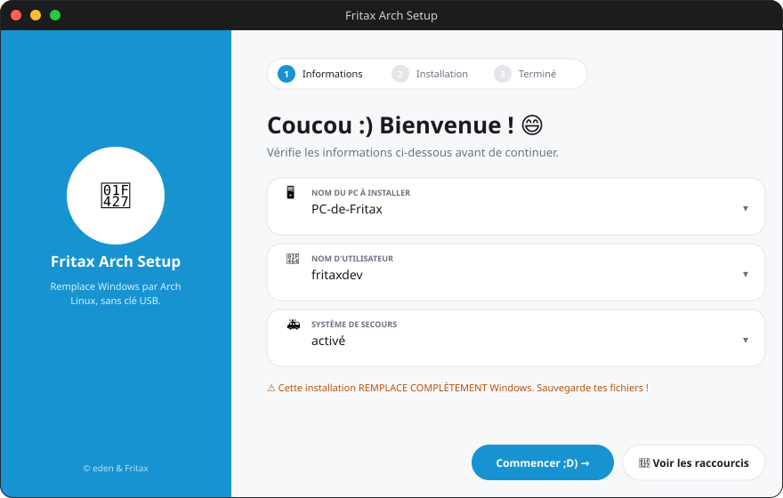
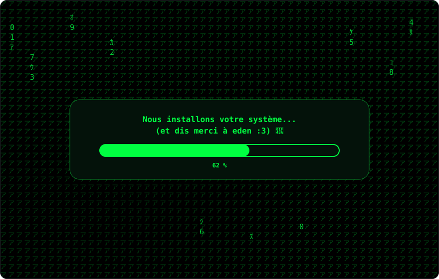

#  Installateur Arch Linux — Fritax Edition 

Installateur "tout-en-un" pour remplacer Windows par Arch Linux sur l'Acer
Aspire 5560 series (model no. MS2319), **sans clé USB**, avec une interface
Windows en français, une pluie Matrix pendant l'installation, un système de
secours, et des raccourcis pratiques.

<p>
  <a href="https://github.com/furaxdev/arch-linux/releases">
    
  </a>
  <a href="https://github.com/furaxdev/arch-linux/actions/workflows/build-exe.yml">
    
  </a>
  <a href="https://fritax-arch-setup.vercel.app">
    
  </a>
  <a href="https://github.com/furaxdev/arch-linux">
    
  </a>
</p>

##  Aperçu

<p>
  
  
</p>

##  Avertissements importants

- Cette installation **efface complètement** le disque choisi, y compris
  Windows. **Sauvegarde tes fichiers avant !**
- Arch Linux ne fournit plus d'ISO 32 bits (x86) depuis 2017 : seule l'ISO
  x86_64 (64 bits) existe. Les deux branches ci-dessous ne changent donc que
  le paquet de microcode installé (`amd-ucode` ou `intel-ucode`), pas
  l'architecture.
- Il faut lancer `windows_installer/ArchInstallerFritax.py` **en tant
  qu'administrateur** pour que l'étape "démarrage sans clé USB" fonctionne
  (modification de la partition système / `bcdedit`).

##  Branches

| Branche | Pour quel processeur ? | Microcode installé |
|---|---|---|
| `amd64-x86` (celle-ci) | AMD | `amd-ucode` |
| `intel64-x86` | Intel | `intel-ucode` |

##  Utilisation

### 0.  Obtenir le fichier .exe (deux options)

**Option A — GitHub Actions (automatique) :** chaque push déclenche le
workflow `.github/workflows/build-exe.yml`, qui compile l'application sur un
runner Windows. Va dans l'onglet **Actions** du dépôt → dernier run
**" Build ArchInstallerFritax.exe"** → télécharge l'artifact
`ArchInstallerFritax-<branche>.exe`.

**Option B — Compiler toi-même sur Windows :**

```powershell
cd windows_installer
build_exe.bat
```

Le fichier `dist\ArchInstallerFritax.exe` est généré (demande automatiquement
les droits administrateur au démarrage, grâce à `--uac-admin`).

> ⚠️ **Windows Defender peut signaler l'exe** (ex: `Trojan:Win32/Sabsik.EN.D!ml`).
> C'est un **faux positif très courant** sur les exécutables PyInstaller non
> signés (détection heuristique par IA, pas une signature de virus connu —
> le `!ml` dans le nom l'indique). Le code source est entièrement visible
> dans ce dépôt. Pour continuer :
> 1. Clique sur "Plus d'infos" → "Exécuter quand même" dans l'alerte SmartScreen, ou
> 2. Restaure le fichier en PowerShell admin :
>    `Add-MpPreference -ExclusionPath "chemin\vers\ArchInstallerFritax.exe"`
>    puis `"%ProgramFiles%\Windows Defender\MpCmdRun.exe" -Restore -All`
> 3. (Optionnel) Signale le faux positif à Microsoft :
>    https://www.microsoft.com/en-us/wdsi/filesubmission

### 1. Sur Windows (préparation, sans clé USB)

Directement avec l'exécutable :

```powershell
ArchInstallerFritax.exe
```

Ou en lançant le script Python :

```powershell
cd windows_installer
python ArchInstallerFritax.py
```

L'application va :
1.  Télécharger l'ISO officielle Arch Linux
2.  La personnaliser (nom de PC `PC-de-Fritax`, utilisateur `fritaxdev`)
3.  Préparer une entrée de démarrage `Fritax - Installer Arch Linux`
   directement depuis le disque dur (technique GRUB "loopback", pas besoin
   de clé USB)
4.  Afficher une pluie Matrix + barre de progression pendant les étapes
   longues, avec le message *"Nous installons votre système... (et dis
   merci à eden :3)"*

Outils requis sur Windows : **7-Zip** et **Windows ADK (oscdimg.exe)** — voir
`windows_installer/requirements.txt`.

### 2. Redémarrage → environnement Arch Linux live

Choisis l'entrée **"Fritax - Installer Arch Linux 🐧"** au démarrage, puis
lance :

```bash
bash /arch/scripts/fritax-setup.sh   # préconfigure hostname + utilisateur
bash scripts/install_arch.sh         # installation complète (partitionnement,
                                      # base, GRUB, système de secours)
```

Une confirmation explicite (`OUI EFFACER`) est demandée avant tout
effacement de disque.

### 3.  Système de secours

Une partition dédiée (`Fritax-Secours`, 4 Gio par défaut) contenant un mini
Arch de réparation est automatiquement créée, avec sa propre entrée dans le
menu GRUB (`fritax-secours`). Si l'installation principale casse, choisis
cette entrée pour réparer (chroot, réinstaller GRUB, etc.).

### 4.  Raccourcis une fois Arch installé

Un script `raccourcis-fritax.sh` est déposé dans le dossier personnel de
`fritaxdev` : un petit menu en français pour les commandes courantes
(mise à jour, installation de logiciels, infos système, etc.) :

```bash
bash ~/raccourcis-fritax.sh
```

##  Structure du projet

```
windows_installer/       Application Windows (Tkinter)
  ArchInstallerFritax.py   Fenêtre principale
  matrix_rain.py           Effet pluie Matrix + barre de progression
  iso_downloader.py        Téléchargement + vérification de l'ISO
  iso_customizer.py        Personnalisation légère de l'ISO
  nousb_boot.py            Démarrage sans clé USB (GRUB loopback + UEFI)
  rescue_installer.py      Résumé du système de secours
  config.py                Config (hostname, utilisateur, raccourcis...)

scripts/                  Scripts exécutés dans l'environnement Arch live
  install_arch.sh            Installation complète automatisée
  setup_rescue.sh             Création du système de secours
  post_install_shortcuts.sh   Menu de raccourcis en français
```

Merci à eden :3
